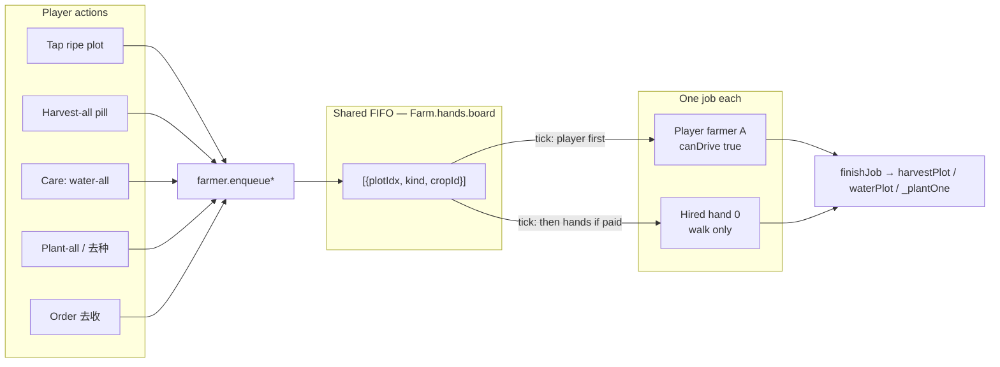
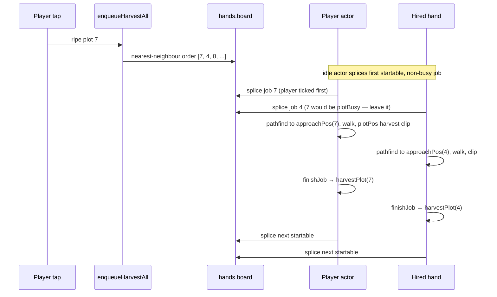

# Hired Farmhands (帮手) · Design

| Field | Value |
|---|---|
| **Title** | Hired Farmhands (帮手) — visible extra actors that share the player's farm-work queue |
| **Author** | Eastern Farm / Grok |
| **Date** | 2026-08-24 |
| **Status** | Draft |
| **Code name** | `Farm.hands` |
| **Primary module** | `src/js/hands.js` (new) |
| **Depends on** | `src/js/farmer.js`, `src/js/pathfind.js`, `src/js/state.js`, `src/js/mapview-iso.js` |

---

## Overview

Eastern Farm's player farmer already walks to a plot, plays a harvest / water / plant clip, and only then mutates the save (`farmer.js` `WORK_HOLD = 1.05s`). On a 4-plot starter that feels cozy. At 12 unlocked plots a harvest-all is ~40–50 seconds of watching one person tour the field. Players have asked for help; the wrong answers are an offline watcher (看场) or an invisible multiplier.

V1 hires **up to two visible 帮手** — extra painted farmer actors that do the **same three jobs** as the player (harvest, water, plant), only while the game is open, and **only from jobs the player already queued**. Pay is a **daily farm-coin contract**. Unpaid hands stay hired but idle-walk inside owned land. They never spend or earn East Points. No name chip over their heads (panel-only).

The implementation extracts a small actor + job-board from the existing singleton `farmer.js` `A`, rather than forking the 1,290-line file. The player remains the boss: tap-to-harvest, harvest-all, plant-all, water-all, and the order-board 去收 / 去种 stay the only producers of work.

---

## Background & Motivation

### Current state

The farm is one actor. `farmer.js` owns a module-private `let A = emptyActor(2)` with `queue[]` and `job`. `emptyActor` exists as a local function; it is **not** on `Farm.farmer` today (export block ~1254–1289). Every producer already funnels through that queue:

| Player action | Code path | What is queued |
|---|---|---|
| Tap a ripe plot | `mapview-iso.js` `_tapCell` → `enqueueHarvestAll(idx)` | All ripe plots, nearest-neighbour from the tap |
| Harvest-all pill | `harvest-status.js` `harvestAll()` → same | All ripe, nearest to the player |
| Plot-care 「浇水」 | `farm.js` `openPlotCare` → `enqueueWaterAll` | All waterable plots |
| 「种满所有空地」 | `shop.js` `plantAllEmpty` → `enqueuePlantAll(cropId)` (iso path) | All empty unlocked plots |
| Order board 去收 / 去种 | `orders.js` `goReap` / `goSow` | `enqueueHarvestAll`; `goSow` goes through `shop.plantAllEmpty` |

Effect happens in `finishJob` after the clip: `Farm.farm.harvestPlot`, `Farm.tending.waterPlot`, `Farm.shop._plantOne`. Crops stay in the ground until the animation ends (painted-farmers spec, 2026-08-20). Queue is **in-memory only** — a refresh leaves remaining ripe crops in the field. That is the contract we keep.

Painted sprites already exist: `LOOKS` 1–9 (including child looks 5/6), `p_farmer_N.webp` / `_back.webp`, `blitSheet` / `heading` / `plotPos` / `approachPos`. Construction-site silhouettes in `mapview-iso.js` `_drawBuildWorkers` are **FX**, not hireable people — they blit the **player** harvest row (`ANIMS.harvest = 3`) at ~`th * 1.08` (player body is `th * 2.05`), 1–2 silhouettes, and vanish when the building finishes. They never read `state.data.hands`.

`tick()` computes `dt` from a module-private `_lastT` then writes `_lastT = now` (`farmer.js` ~958–962). `isoView.render()` calls `Farm.farmer.tick(this)` once per frame (~5310). A second `tickActor` in the same `render()` **must not** recompute `_lastT` or the helper's `dt` is 0 every frame.

### Pain

At 12 plots a single farmer is slow enough that a 3–10 minute session (GAME-DESIGN.md) spends a large slice of itself watching one person walk. Coins are abundant (the designed sink side of the two-currency system); East Points are Chris's real liability. Players with extra coins have nothing useful to spend them on that shortens *session chores* without printing production.

### What we are not solving

Happy Farm-style hired NPCs that keep harvesting after you close the app. That is 看场. It would silently fill the barn, smash the order-economy "player action is the loop" rule, and turn a cozy 5-minute visit into a collection screen. Locked: **no offline work.**

---

## Goals & Non-Goals

### Goals (V1)

1. **帮手, not 看场, not 全能.** Harvest, water, plant. Same `WORK_HOLD`, same `plotPos` / `approachPos`, same `heading`.
2. **Visible.** Extra actors drawn with the existing painted sheets. Player-facing noun is **帮手 / Hired hand**. No fake names (`ai-neighbors.RETIRED=true` still holds). **Panel-only** — no 「帮手」 chip over the idle helper (Chris 2026-08-24).
3. **Player is the boss.** Hands only take jobs already on the shared board, which is filled only by existing player actions listed above.
4. **Farm coins only.** Daily wage via `Farm.state.spendCoins`. Never `spendEastPoints`, never `cost_ep`.
5. **Cap is small.** V1: max **2** hired hands at the same unlock (≥12 plots). `MAX_HANDS = 2`. `maxAllowed() = isUnlocked() ? 2 : 0`. Extra save rows beyond `MAX_HANDS` stay in the blob unpaid and unspawned — never billed, never deleted.
6. **Daily contract.** Charged on local day rollover through `Farm.state.getDateString` (same Saskatchewan-local day as `homeUpkeepOn`). Unpaid → stay hired, **idle-walk inside owned bounds** (not a statue), pay button. Never silently fire.
7. **Unlock when the farm is actually big.** ≥ **12 unlocked plots**, however they were obtained (level unlocks or extra plots). Not during tutorial / spotlight. Not gated on `landLevel`.
8. **Build mode keeps farm work running** (just shipped in `doingFarmWork`). Hired hands use the same per-actor rule; unpaid hands freeze idle-walk in build mode.
9. **Copy.** Full sentences, no 啦/吧/哦/～, no slogans. ZH and EN each stand alone. Noun is 帮手 / Hired hand. No on-farm role chip.

### Non-Goals (V1 and explicit)

| Not doing | Why |
|---|---|
| Harvest / water / plant while the tab is closed or `document.hidden` | 看场. Existing rAF loop already skips hidden (`mapview-iso.js` `_startLoop`). Hands must not add a background path. |
| Speed up construction | `_drawBuildWorkers` stays cosmetic FX. `buildDurationMs` unchanged. |
| Drive the player's car | `A.driving` is a singleton map index; two drivers fight over one car. Auto-drive is player joy (`MIN_DRIVE_DIST` / `REDRIVE_DIST`). Hands **walk only**. |
| Fertilize, accelerate, polish, board, steal, tend neighbors | Player-only. Visit (`_visitLock`) already blocks enqueue. |
| Invent NPC biographies or 王阿姨/李大爷 | Locked. Role label only. Look picker reuses `LOOKS` 1–9, including child looks 5/6. |
| Pay with East Points, or earn EP for hiring | EP 1:1 real store points = Chris's liability. |
| Auto-empty the farm on open | Would skip the tap-to-harvest loop. |
| Persist the in-flight job queue | Player farmer already doesn't. Refresh = crops still in the ground. |
| Follow-cam onto the hired hand | `_followActorCam` stays on the player / their car. Dead-zone walk-follow must not fight a second body. |
| Host workers visible on visit | V1 visit is steal / tend + host farmer idle-walk. Don't simulate the neighbor's payroll. |
| A new audio file | Reuse `audio.play('harvest'|'water'|'plant'|'buy'|'error')`. |

---

## Proposed Design

### 1. Unlock math (exact numbers)

From `state.js`:

| Stage | Unlocked plots | How |
|---|---|---|
| New farm | **4** | `STARTER_STATE.plots` first four `unlocked: true` |
| Level 2 / 3 / 4 / 5 | 6 / 8 / 10 / **12** | `PLOT_UNLOCK_AT` +2 per level through Lv 5 |
| Level 7 / 10 / 12 / 15 | 13 / 14 / 15 / **16** | +1 each |
| Later (not a V1 gate) | 18 by Lv 20, 26 by Lv 500 | +1 also at 17, 20, 30, … 500 |
| Extra plots | +0..**8** | `EXTRA_PLOT_CAP = 8`, coin costs `[200, 600, 1500, 3000, 4500, 6000, 8000, 10000]` |

Land expansion (`LAND_LEVELS_FRONT` / `_BACK` in `mapview-iso.js`) is a **different axis**: Lv 0 is the starter rectangle, Lv 1 costs **800 coins**. It gates building/planting *where*, not how many plots you work. A 12-plot farm on starter land is already slow to harvest-all. **Do not require `landLevel ≥ 1`.**

**Unlock:** `unlockedPlotCount() >= 12`, however those 12 were obtained. Level 5 is the usual path (the original 4→12 ramp). Extras can get there earlier: Lv 4 has 10 level-plots, two extras cost 800 coins. Tutorial/spotlight finish around 4 plots; they will not see the hire entry.

**Both slots at the same gate (Chris 2026-08-24):** once unlocked, the player may hire **two** helpers. Do not wait for 16 plots. `MAX_HANDS = 2`. `maxAllowed() = isUnlocked() ? 2 : 0` (no separate `SECOND_AT`). Hiring the second is optional; the first wage is still 180, the second 280.

```js
function unlockedPlotCount() {
  const plots = (Farm.state.data && Farm.state.data.plots) || [];
  let n = 0;
  for (let i = 0; i < plots.length; i++) if (plots[i] && plots[i].unlocked) n++;
  return n;
}
```

### 2. Economy (first principles)

Hiring is a **time-to-coins converter**, not a production multiplier. Hands do not create extra harvests. They finish the *same* board faster during an open session. The barn, order board, and seed costs are unchanged. Therefore the wage cannot "print coins"; the only failure mode is **too cheap** (noise, not a sink) or **too expensive** (bok-choy farms never hire).

**Time saved at unlock (12 plots, `WALK_SPEED = 2.2`, `WORK_HOLD = 1.05s`):**

Assume ~3 s walk + 1.05 s clip per plot ≈ 4 s. Harvest-all ≈ **48 s** solo (upper bound — adjacent plots are closer than 3 s), ≈ **24 s** with one walker, ≈ **16 s** with two (player + 2 hands splitting the FIFO). A 5-minute session with 2–3 harvest-alls saves **~1–1.5 minutes of watching**. Worth paying for — without turning the farm into a factory.

**Income at the 12-plot gate** (crops.json sheet prices, then sold through the 2026-08-22 order board). Demand volume is plots × min(growth cycles, **logins**), not "however many 5-minute cycles fit in a day":

| Mix | Seed | Sell 1.0× (staple) | Net / plot | 12-plot cycle | 2 cycles / day |
|---|---|---|---|---|---|
| 上海苗 (`shanghai_miao`, 5 min) | 5 | 18 | 13 | 156 | 312 |
| Mixed ~30 min greens (sell ~55, seed ~12) | 12 | 55 | 43 | 516 | 1,032 |
| Same, delivered on a 1.5× order | 12 | 82.5 | 70.5 | 846 | 1,692 |
| 白萝卜 / 胡萝卜 (unlock_level 5, 120 min) | 28 / 26 | 190 / 185 | ~162 | ~1,944 | one cycle/day |

One login on a 12-plot shanghai_miao farm sells ~12 × 13 = **156 net**. Hand 1 costs 180; both hands cost **180 + 280 = 460** — more than that day's produce, often more than two cheap-crop logins. The "38% of 3 cycles" band only holds if they log in enough to sell 3 cycles of mixed greens. **If they only log in once, a cheap-crop day will often skip paying both — intended.** Do not raise the wage without Chris playing. They can still hire just one (180).

A realistic multi-login Lv 5 day is **~400–1,200 coins** from produce after seeds, before house upkeep (courtyard ~15–20 / day) and fertilizer (150).

**Comparable existing coin sinks:** car polish 50, fertilizer 150, extra plot #1 200, land expand 800.

**V1 numbers (constants in `hands.js`, not JSON — wage is a contract, not a catalog SKU):**

| Knob | Value | Rationale |
|---|---|---|
| `WAGE[0]` (hand 1 / day) | **180 coins** | Between fertilizer (150) and extra-plot-1 (200). Noticeable sink, still hireable on mixed crops; bok-choy one-login days skip — correct. |
| `WAGE[1]` (hand 2 / day) | **280 coins** | Superlinear so two hands are a choice, not a default. Both at unlock: **460 / day**. |
| Hire fee | **today's wage only** | No separate signing bonus. Hire = pay today. |
| Rehire same day after dismiss | Charge again | Edge case; don't build a ledger. |
| Refund on dismiss | None | They already had the day. |
| Currency | `spendCoins` only | Never EP. |
| Auto-pay on rollover | Yes, if `coins >= wage` | Same pattern as `collectHomeUpkeep`. If broke: idle-walk, do not fire. |

Hands never grant XP, East Points, or order credit **by themselves**. Completions go through existing `Farm.farm.harvestPlot` / `_plantOne` / `waterPlot`. `crops.harvest` (`crops.js` ~179–241) already rolls: **3% lucky +5** (×2 weekend), festival `east_points_bonus`, **0.5% jackpot 20–100**, first-of-day +5. There is **no** 5% +1 harvest bonus. Two actors can `finishJob` in the same frame or within 1 s. StockWise `GAME_MIN_EARN_INTERVAL_SEC = 3` is **cross-source**; a second `addEastPoints` in that window 429s and the client rolls back (`crops.js` 190–199). Solo farmer already brushes this (`WORK_HOLD = 1.05s`); two bodies make simultaneous lucky/festival harvests easy. **Accept the existing 3 s earn gate.** Do not invent a client-side EP suppressor in `hands.js`. If Chris sees vanished lucky-EP toasts during harvest-all, the fix belongs in `addEastPoints` coalescing, not in farmhands. **Do not add a new EP source.**

Two actors completing in the same second may double-fire harvest SFX; that is fine (combo step still uses the global `_comboCount` in `farm.js`).

### 3. Architecture

Do **not** copy `farmer.js`. Extract the singleton so both the player and hired hands are `emptyActor` structs.





**`dt` once per frame, one tick callsite:** `Farm.farmer.tick(iso)` is the **only** caller of `hands.tick`. It computes `dt` from `_lastT` **once**, writes `_lastT = now`, then `tickActor(iso, A, PLAYER_OPTS, dt)`, then `if (Farm.hands && Farm.hands.tick) Farm.hands.tick(iso, dt)`. Hands receive that same `dt`. Do not give each actor a `_lastT`. Do not let `hands.tick` recompute elapsed time. **Do not** call `hands.tick` from `isoView.render` (that would double-step helpers: 2.2 → 4.4 cells/s). There is no `Farm.farmer.lastDt()`. `isoView.render` order: `_tickBuilds` → `farmer.tick` (owns `_lastT` **and** hands) → later depth-draw `farmer.depthDraw` **and** `hands.depthDraws` into `draws` then `sort`.

**Who pops:** player `tickActor` runs first. Then each paid hand. An idle actor with `canWork` **scans** the board for the first startable, non-busy job and **splices that index**. It does **not** `shift()` a `plotBusy` head.

```js
function claim(iso, actor, opts) {
  if (actor.job) return;
  if (!actorCanWork(actor, opts)) return;   // hands: paid today and !_visitLock
  const board = Farm.hands.board;
  for (let i = 0; i < board.length; i++) {
    const job = board[i];
    if (plotBusy(job)) continue;            // another actor holds this plot+kind — leave it
    if (!jobStartable(iso, job)) {          // stale (empty / not ripe / already watered)
      board.splice(i, 1);                   // drop, same as today's startJob-false skip
      i--;
      continue;
    }
    board.splice(i, 1);
    if (startJob(iso, actor, job, opts)) return;
    // startJob failed for a non-stale reason (path) — put it back at i so the
    // next actor can try, then keep scanning.
    board.splice(i, 0, job);
  }
}

function plotBusy(job) {
  if (jobHeld(A, job)) return true;
  const acts = (Farm.hands && Farm.hands.actors) || [];
  for (let i = 0; i < acts.length; i++) if (jobHeld(acts[i], job)) return true;
  return false;
}
function jobHeld(actor, job) {
  return !!(actor && actor.job
    && actor.job.plotIdx === job.plotIdx && actor.job.kind === job.kind);
}
```

**Same-plot block:** a job is not startable if any live actor (player or hand) already has `job.plotIdx === plotIdx && job.kind === kind`. `enqueue` de-dupes against the board **and every live `actor.job`** (player `A` plus `hands.actors`). Two people never harvest the same plot. PR2 (no hands module yet) de-dupes board + `A.job`; PR3 extends the walk to `hands.actors`.

**`startJob` REDRIVE:** today's block (~905–912) does `A.queue.unshift(job)` and `board(carIdx)`. A hand sharing that path would board the player's car. When `!opts.canDrive`, **skip the entire REDRIVE / `pickCarFor` block**. When the **player** REDRIVE fires, unshift the job onto `Farm.hands.board` (fallback: `A.queue` if no board). Never fork a second pending queue.

**`enqueue` auto-drive** (`A.queue.length === 1 && !A.job`, ~148–154): still only looks at the **player** actor, keyed off shared-board length becoming 1 while `A.job` is null. Hands never auto-drive.

**Harvest-all split:** keep the existing nearest-neighbour order in `enqueueHarvestAll`. Do **not** pre-assign "north to player, south to hand." FIFO + player-pops-first + splice-first-free naturally gives the tap's nearest plot to the player and the next free plot to the helper.

**Cap on the board:** still `unlockedPlotCount()` (today's `A.queue.length >= cap`). The board, not per-actor queues, holds pending work. Each actor holds at most one `job`.

### 4. Module layout

New file `src/js/hands.js`, IIFE, `Farm.hands = { ... }`. Script tag in `src/index.html` **after** `farmer.js` and **before** `mapview-iso.js`:

```html
<script defer src="js/pathfind.js"></script>
<script defer src="js/farmer.js"></script>
<script defer src="js/hands.js"></script>
<script defer src="js/mapview-iso.js"></script>
```

`farmer.js` must load first because `hands.js` calls `Farm.farmer.emptyActor` (exported in PR1), `tickActor`, `startJob`, `depthDrawActor`, `heading`, `clampLook`, `previewStyle`.

**PRECACHE:** PR3 **must** add `'/src/js/hands.js'` to `service-worker.js` PRECACHE, immediately after `farmer.js` (~line 101). `deploy.sh` gate 1b (`scripts/verify/precache-check.mjs`) fails if `index.html` loads a script missing from PRECACHE. Do **not** bump `CACHE_VERSION` by hand; `deploy.sh` still stamps it. Farmer **sheets** stay on-demand (not precached); the new JS module does not.

### 5. farmer.js extraction (no behaviour change on the player)

Almost every simulation function in the 1,290-line file closes over module-private `A`. PR1 parameterises **every function that reads/writes `A` in the walk / work / idle loop**. Drive / polish / board / visit-stash stay behind `opts` on the player path.

Functions that must take an `actor` (not an exhaustive C list — the rule is "touches `A` in walk/work/idle"):

| Function | Why a second body needs it |
|---|---|
| `tickActor(iso, actor, opts, dt)` | The loop. `dt` is passed in; never reads `_lastT` |
| `moveToward(actor, dt, tx, ty, speed)` | All walking |
| `frameIndex(actor)` | Work frames use `actor.frameT` / `actor.anim` |
| `blitSheet(..., actor)` | Walk bob / hop read `actor.frameT` |
| `drawActor` / `depthDrawActor(iso, actor)` | `actor.walkDust`, hop |
| `hopLift(actor, th)` / `tickWalkDust(actor, dt)` | Dust and board-hop are per-body |
| `pickIdleTarget(iso, actor)` | Reads `actor.gx` / `actor.gy`, owned bounds only |
| `spawnAt(iso, actor)` | Hands spawn too |
| `startJob(iso, actor, job, opts)` | Pathfind + REDRIVE gated on `opts.canDrive` |
| `finishJob(iso, actor)` | Completes onto harvestPlot; filters the **board** |
| `doingFarmWork(actor)` | Per-actor, board-aware (see below) |
| `claim(iso, actor, opts)` | Splice first startable job |

Leave behind `opts` (player-only when the flag is on): `board` / `unboard` / `polish` / `travelTo` / `pickCarFor` / `tickDrive` / visit-stash of `A`.

`emptyActor` **exists, is not exported today.** PR1 exports it as `Farm.farmer.emptyActor`.

Keep a **zero-arg** `doingFarmWork()` wrapper `() => doingFarmWork(A)` so `farmer-work-test.mjs` (`function doingFarmWork(`, `iso._build && !doingFarmWork()`) can be migrated in the **same** PR rather than going red. Update that test in PR1: it may assert the wrapper still exists **and** `doingFarmWork(actor)` / `tickActor` / `startJob(iso, actor`. Do not leave the regex gate for a later PR.

`Farm.farmer.tick(iso)` stays the public entry and the **only** place `hands.tick` is called (tests that loop `Farm.farmer.tick(iso)` still move helpers; a missed iso line cannot skip them or double them):

```js
function tick(iso) {
  if (!iso || !iso._on) return;
  const now = Date.now();
  const dt = _lastT ? Math.min(0.12, (now - _lastT) / 1000) : 0.033;
  _lastT = now;
  tickActor(iso, A, PLAYER_OPTS, dt);
  if (Farm.hands && Farm.hands.tick) Farm.hands.tick(iso, dt);
}
```

`isoView.render` must **not** call `hands.tick`. No `lastDt()` helper. If `Farm.hands` is missing, the `if` is a no-op (PR1/PR2).

`blitSheet(ctx, iso, look, anim, fi, x, y, face, away, actor)` takes the actor for `frameT` / hop. `drawGuest` passes a dummy `{ frameT: Date.now()/1000 }`.

`enqueue*` **stop pushing onto `A.queue` once the board exists**. They push onto `Farm.hands.board` (fallback `A.queue` if `Farm.hands` is missing). De-dupe:

1. `Farm.hands.board`
2. `A.job`
3. PR3+: every `hands.actors[i].job`

`A.queue` remains only as a fallback / visit-stash compatibility. After the extract, player pending work lives on the shared board.

**`doingFarmWork(actor)`:**

```
in-flight job.kind in harvest|water|plant|boarding on THAT actor
OR (opts.claimBoard && canWork(actor) && board nonempty)
OR that actor's fallback queue nonempty
```

Unpaid hands: `canWork` is false, so a nonempty board does **not** count as them doing farm work — they freeze idle-walk in build mode while the player harvests. If the player has `job == null` and the board is nonempty, `doingFarmWork(A)` is still true so `iso._build && !doingFarmWork()` does not freeze the player before they claim the next plot (the 2026-08-24 regression).

`finishJob` warehouse-full / out-of-coins filters write the **board** (drop remaining `kind === 'harvest'`, or remaining `plant` of that `cropId`), not `A.queue`. Fallback: if no board, filter `A.queue` as today.

Player-only `tickActor` opts: `{ canDrive: true, canPolish: true, canIdleWander: true, claimBoard: true }`. Hand opts: `{ canDrive: false, canPolish: false, canIdleWander: true, claimBoard: true }`. If `actor.driving` is somehow set on a hand, ignore it.

### 6. Farm.hands public API

```js
Farm.hands = {
  MAX_HANDS: 2,            // V1 (Chris 2026-08-24): both slots at unlock.
  UNLOCK_PLOTS: 12,
  WAGE: [180, 280],        // slot 0 then slot 1; both = 460 / day

  board: [],               // in-memory FIFO {plotIdx, kind, cropId}
  actors: [],              // in-memory emptyActor[], length === min(save.hands.length, MAX_HANDS)
  _visitHold: null,        // { actors, board } stashed on enterVisit
  _lastWageDay: '',        // module guard for once-per-date collectWage from tick

  unlockedPlotCount: function () { /* ... */ },
  isUnlocked: function () { return this.unlockedPlotCount() >= this.UNLOCK_PLOTS; },
  maxAllowed: function () { return this.isUnlocked() ? this.MAX_HANDS : 0; },
  liveCount: function () {
    const rows = (Farm.state.data && Farm.state.data.hands) || [];
    return Math.min(rows.length, this.MAX_HANDS);
  },
  canWork: function (slot) { /* slot < liveCount && paidThroughDate === today && !_visitLock */ },
  wageOf: function (slot) { return this.WAGE[slot] || this.WAGE[0]; },

  hire: function (look) { /* push row FIRST, then spendCoins; revert if spend fails; maybeSyncFromSave */ },
  pay: function (slot) { /* set paidThroughDate FIRST, then spendCoins; revert if spend fails */ },
  dismiss: function (slot) { /* splice save + actor; no refund */ },
  applyLook: function (slot, look) { /* clampLook, save */ },

  collectWage: function () { /* day rollover auto-pay for i < liveCount */ },
  openPanel: function () { /* hire / pay / dismiss / look */ },

  tick: function (iso, dt) { /* boot-sync if length mismatch; collectWage once/day; tickActor each live hand with dt */ },
  depthDraws: function (iso) { /* [] during _visitLock; else array of {d, fn} */ },
  actorAtPoint: function (iso, x, y) { /* tap target; see §9 order */ },

  onEnterVisit: function () { /* stash actors+board; clear live actors/board */ },
  onExitVisit: function () { /* restore stash; never syncFromSave from visit vd */ },
  syncFromSave: function () { /* no-op if _visitLock; else rebuild actors[0..liveCount) and spawnAt any gx==null */ },
};
```

`hire` / `pay` / `dismiss` no-op under `_visitLock`. `hire` refuses if `!isUnlocked()`, `liveCount() >= min(MAX_HANDS, maxAllowed())`, or coins < wage.

**Hire / pay is one save transaction.** `state.spendCoins` always `this.save()` immediately (`state.js` ~887–892). Written order **must** be:

1. Mutate `data.hands` (push the row, or set `paidThroughDate = today`).
2. `spendCoins(wage)` — that save includes the row.
3. If `spendCoins` returns false, revert the mutation (splice the new row / restore previous `paidThroughDate`). Do not call a second `save()` unless something else changed.

Crash or a second tab's session-token freeze between those lines then persists **person + unpaid coins**, not **paid coins and no person**. Tests: hire with `coins = 180` leaves `hands.length === 1` and `coins === 0` in the same `localStorage` snapshot.

Spawn position: one grass cell south/east of home (`_homes()[0]`), else `approachPos(iso, 0)`, else owned-bounds centre. Offset by `slot * 0.7` so two bodies don't stack. `gx/gy` are memory-only (same as the player).

Idle wander: `pickIdleTarget(iso, actor)` **inside owned bounds only**. Hands never roam the wild woods on their own — out-of-bounds walking is a player tap on empty grass (`farmer.travelTo`, player-only). **Unpaid hands still idle-walk** (not a statue). They just don't claim from the board. QA: wandering while unpaid is correct.

**Boot / length-mismatch sync.** `actors` starts `[]`. Visit stash/restore is not a boot path: a cold load with `state.data.hands = [{ look: 7, paidThroughDate: today }]` would otherwise leave nobody on the map, `depthDraws` empty, and `hire()` refusing because `liveCount() >= 1`. Guarded rebuild is the boot path, and it is a no-op during visit:

```js
function maybeSyncFromSave() {
  if (Farm.state && Farm.state._visitLock) return;
  if (this.actors.length !== this.liveCount()) this.syncFromSave();
}
```

Call `maybeSyncFromSave` from:

1. **`isoView.init`**, next to `collectWage` / `collectHomeUpkeep` — first frame has bodies.
2. **`hands.tick`**, before `tickActor` — safety net if init raced `hands.js` or `applyCloudSave` landed mid-session.
3. **`hire` / `dismiss` after a successful mutation** — spawn or drop the matching actor immediately (still fine if they also trip the length check next tick).

`syncFromSave` rebuilds `actors[0..liveCount)` from `state.data.hands`, `spawnAt` any body with `gx == null`, and does **nothing** under `_visitLock`. It must not read visit `vd.hands`.

### 7. Persistence

Do **not** bump `STARTER_STATE.version`. `farmerLook` set the precedent: new top-level field, `Object.assign` from STARTER fills it on old saves.

```js
// STARTER_STATE
hands: [],            // [{ look, hiredAt, paidThroughDate }]
handsUnlockSeen: '',  // '' = never prompted; sticky '1' after the once-ever prompt
```

Per-hand save row:

```js
{
  look: 7,                    // 1–9, clampLook; default a look ≠ player.farmerLook
  hiredAt: 1755993600000,     // Date.now() at hire; never used as a name seed
  paidThroughDate: '2026-08-24'  // getDateString(); empty / past = idle-walk
}
```

**Do not store `idle`.** Derive: `paidThroughDate !== getDateString()`. Storing it desyncs across midnight and cloud restore.

**Do not store `gx/gy/job/queue`.** Memory only.

**`handsUnlockSeen` is sticky `'1'` (once ever), not a YYYY-MM-DD.** "Not now" plus once-ever is fine because Settings still shows the row when `isUnlocked()`. Sanitize: any truthy string or `true` → `'1'`; otherwise `''`.

One `sanitizeHands(data)` used from `state.init()` **and** `applyCloudSave` (the latter does **not** run `init()`, so a 99-row cloud blob is live until next full boot unless the apply tail sanitizes):

```js
function sanitizeHands(data) {
  if (!data || typeof data !== 'object') return data;
  if (!Array.isArray(data.hands)) data.hands = [];
  data.hands = data.hands.slice(0, 2).map(function (h) {
    if (!h || typeof h !== 'object') return null;
    const look = Farm.farmer && Farm.farmer.clampLook
      ? Farm.farmer.clampLook(h.look) : ((h.look >= 1 && h.look <= 9) ? (h.look | 0) : 7);
    return {
      look: look,
      hiredAt: (typeof h.hiredAt === 'number' && isFinite(h.hiredAt)) ? h.hiredAt : Date.now(),
      paidThroughDate: (typeof h.paidThroughDate === 'string') ? h.paidThroughDate : '',
    };
  }).filter(Boolean);
  // Cap at 2 rows (= MAX_HANDS). A tampered 99-row blob keeps the extra
  // rows unpaid and unspawned. Do not delete. 永不弃档.
  if (data.handsUnlockSeen) data.handsUnlockSeen = '1';
  else data.handsUnlockSeen = '';
  return data;
}
```

After `applyCloudSave` assigns `this.data = merged` and sanitizes, call `Farm.hands.syncFromSave()` **only if `!_visitLock`**. Cold boot does **not** go through `applyCloudSave`; that is why `isoView.init` and `hands.tick` also run the length-mismatch sync (§6). Never rebuild actors from visit `vd` (that object has no `hands` field today; a future `worldLayout` must not spawn the host's payroll into the guest).

Default look on hire: first `LOOKS` id that is not `state.data.farmerLook`, preferring 7 (爷爷) then 9 (店员) then 1. Player may change it in the panel, including to child looks 5/6 — allowed, on-brand for mom+kid, not a QA bug. Two people may share a look — allowed, no fake names to distinguish them.

### 8. Day rollover / pay

`collectWage` runs:

1. From `isoView.init` next to `collectHomeUpkeep` (**and** `hands.syncFromSave` / `maybeSyncFromSave` in the same init burst).
2. From the hire panel (pay button / open).
3. **Once per local date from `hands.tick`**, guarded by module `_lastWageDay === getDateString()`. House upkeep only re-evaluates when `collectHomeUpkeep` runs, so a tab left open past midnight does not neglect the house. Hands **would** flip `canWork` false at 00:00 if we only mirrored that. Tick-side collectWage auto-pays if they have coins, otherwise they idle-walk until the player opens the panel. Unpaid toast is `isBusy()`-gated and also waits until no in-flight farm work (see §10).

`hands.tick` order: `maybeSyncFromSave()` → `collectWage()` (date-guarded) → `tickActor` each live actor.

```js
collectWage() {
  if (!Farm.state || Farm.state._visitLock) return;
  const today = Farm.state.getDateString();
  const rows = Farm.state.data.hands || [];
  const n = Math.min(rows.length, this.MAX_HANDS);   // do not bill unspawned extra rows
  for (let i = 0; i < n; i++) {
    if (rows[i].paidThroughDate === today) continue;
    const wage = this.wageOf(i);
    const prev = rows[i].paidThroughDate;
    rows[i].paidThroughDate = today;                 // mutate FIRST
    if ((Farm.state.data.coins || 0) >= wage && Farm.state.spendCoins(wage)) {
      // spendCoins saved the row + the debit
    } else {
      rows[i].paidThroughDate = prev;                // revert; no second save
    }
  }
  this._lastWageDay = today;
  // unpaid toast: a live slot is unpaid, !isBusy(), no in-flight farm work
}
```

`canWork` / UI pay buttons / `tickActor` claim also iterate `i < min(rows.length, MAX_HANDS)`. Extra rows beyond 2 stay in the save, unpaid and unspawned. That is the 永不弃档 behaviour — **keep them, do not bill them.** Auto-pay walks slots in order (0 then 1). If coins cover 180 but not 280, hand 0 works and hand 1 idle-walks.

`getDateString` uses the device's local calendar date. Comments in `store-demand.js` call that "萨省 UTC-6"; Saskatoon has no DST. **Do not invent a UTC-6 converter.** Same helper as `homeUpkeepOn`.

If unpaid, the actor still stands on the farm and idle-walks inside owned land. They **do not claim** from the board. Panel chip: 「付今天工钱 · 180」.

### 9. Rendering, tap, camera, visit, build

**Tick/draw insertion vs construction FX:** `isoView.render` already `_tickBuilds` (scaffold + `_drawBuildWorkers` later inside `_drawBuilding`) → `farmer.tick` (**the only `hands.tick` callsite**, inside farmer.tick) → build the `draws` list (plots, buildings including construction FX, pets, `farmer.depthDraw`, **`hands.depthDraws`**) → `draws.sort` by `d`. `isoView.render` never calls `hands.tick`. A hand standing on a site sorts by `gx+gy+0.35` (idle) / `+0.62` (work) against the scaffold; unspecified overlap is accepted. Construction FX still does not read `state.data.hands`.

**Tap order** (match the actual pointer path in `mapview-iso.js` ~1171–1186, then insert hands). Do not use `_spriteHit` (that iron rule is about *buildings* eating grass). Use a small screen box around the sprite (~`th * 1.2` tall, `th * 0.7` wide):

1. Pets (❤️)
2. Car-care (`_carCareAt` / polish)
3. Plots (`_cellToPlot` — harvest / plant / care)
4. Buildings / cars
5. **Hands** (`actorAtPoint`)
6. Empty grass `travelTo` (player only)

A hand on a plot's front edge during the clip loses to the plot — correct. A hand on the car-care hot zone loses to polish — correct. A hand on a pet loses to ❤️ — correct.

Tap a hand → `openPanel()`. Tap empty grass → still only the player `travelTo`s.

**Camera:** `_followActorCam` stays player/car only.

**Visit:** `enterVisitFarm` **replaces** `Farm.state.data` with a synthetic `vd` that has **no** `hands` field (`mapview-iso.js` ~2453–2481). The real save is on `_visit.savedData`.

While `_visitLock`:

- Do **not** `syncFromSave` (visit `vd` would look like `hands === undefined` → `[]` and wipe local actors; a future host blob must not spawn neighbor payroll).
- Do **not** `claimBoard`.
- Do **not** `depthDraws` (return `[]`).
- Do **not** `collectWage`.
- `hire` / `pay` / `dismiss` no-op (necessary, not sufficient).

Wire `mapview-iso.js` `enterVisitFarm` / `exitVisitFarm` to `Farm.hands.onEnterVisit` / `onExitVisit` beside the existing `farmer.onEnterVisit` / `onExitVisit` calls (~2482 / ~2507). `onEnterVisit`: stash `{ actors, board }` on `_visitHold` (same idea as `A.visitHold`), then clear live `actors` / `board`. `onExitVisit`: restore the stash; do **not** rebuild from visit `vd`. If the stash is empty (should not happen on a normal enter/exit of a hired farm; a defensive `maybeSyncFromSave` after restore is OK only because `_visitLock` is already cleared and `state.data` is the real save again). `startJob` itself does not need a visit check if every claim path goes through `canWork` / `actorCanWork` which includes `_visitLock`; enqueue already no-ops. E2E: enter visit with a hired hand, assert local save still has the row after exit and `syncFromSave` was not fed `vd.hands`.

**Build mode:** `tickActor` uses `doingFarmWork(actor)` as specified in §5. Hands mid-harvest keep going. Unpaid / idle hands freeze idle-walk. Hands do not path into a building being dragged (`cellWalkable` already treats buildings as blocked).

**Hidden tab / open modal:** `_startLoop` returns without `render()` when `document.hidden` **or** `#modal` is open (~4618–4619). Hire `showModal` therefore pauses **both** bodies mid-clip, same as every other modal today. Do not add a `setInterval` worker. Contract test: `hands.js` must not call `harvestPlot` itself.

### 10. UI / copy

Dedicated panel, **not** an `ep-shop.json` SKU. Daily wage is a contract with pay / idle / dismiss states; the shop `_apply` kinds (`stack_consumable`, `extra_plot`, `decoration`, `instant_spin`) cannot express that without a new kind that immediately opens a second UI. Discovery is the unlock prompt + Settings row + tapping the person.

Noun: **帮手 / Hired hand** in titles, buttons, diary, toasts. **No on-farm role chip** (Chris 2026-08-24: panel-only). Do not introduce 帮工 as a second player-facing word. Do not draw a label over the idle helper.

**Unlock prompt** once ever (`handsUnlockSeen !== '1'` → set `'1'` when shown, including "Not now"). `Farm.ui.isBusy()` must be true-guard: do not cover spotlight or splash. Also wait until `!doingFarmWork(A)` and no hand has an in-flight `harvest|water|plant` job — `_startLoop` pauses rAF while the modal is open, so prompting during harvest-all would freeze the chore they just started.

ZH: 「菜地够多了，可以请帮手一起收、浇、种。最多两位。按天付农场币，当天付过工钱才会干活。」
EN: 「The farm is big enough to hire a hand. You can hire up to two. They harvest, water, and plant with you. Paid in farm coins each day — they only work on a day that is paid.」

Button: 「去请帮手」 / 「Hire a hand」. Secondary: 「先不要」 / 「Not now」.

**Panel** (`openPanel`, `closeOnBackdrop: true`, ✕ on `.modal-content`, body in `.modal-body`, 48px buttons):

Title: 「帮手」 / 「Hired hand」

If not unlocked: 「地还少，自己顾得过来。菜地到 12 块以后可以请帮手。」 / 「The farm is still small enough to run on your own. A hired hand unlocks at 12 plots.」

If unlocked and none hired: look grid (reuse `.farmer-look-grid` / `previewStyle`, all nine looks including 5/6 男孩/女孩) + 「请帮手 · 180 农场币 / 天」 / 「Hire a hand · 180 farm coins a day」.

If one hired and a slot remains: that person's look + pay/dismiss for slot 0, plus 「再请一位 · 280 农场币 / 天」 / 「Hire a second hand · 280 farm coins a day」 (look grid for the new slot).

If hired and paid today: look grid per slot (can change free) + status 「帮手今天会跟你一起收菜、浇水、播种。点熟菜、点全收，或在打理里点浇水，大家一起去。」 / 「The hired hand will harvest, water, and plant with you today. Tap ripe crops, Harvest all, or Water in plot care, and you go together.」 + dismiss per slot.

If a slot is unpaid: 「今天的工钱还没付，这位帮手先歇着。」 / 「Today's wage is unpaid, so this hired hand is sitting it out.」 + 「付今天工钱 · 180」 or 「· 280」 for that slot. Pay slots independently. If coins cover only the first wage, hand 0 works and hand 1 idle-walks.

Broke: 「农场币不够付今天的工钱。」 / 「Not enough farm coins for today's wage.」 (`toast_not_enough_coins` exists; this sentence is specific enough to keep.)

Dismiss **confirm** (question / future, not past tense): 「帮手先回去？随时可以再请。」 / 「Send the hired hand home? You can hire again any time.」
Dismiss **done toast** (after they confirm): 「帮手先回去了。随时可以再请。」 / 「The hired hand has gone home. You can hire again any time.」

**Settings → 农场显示:** below the player look grid, if `isUnlocked()` or already hired, a row 「帮手」 / 「Hired hand」 that calls `openPanel()`. If not unlocked, omit the row (don't tease).

**HUD:** no new always-on button. Harvest-all pill stays the work trigger.

Life-story: one diary line on first hire, `lifeStory.record('hands_hire', '农场请来了帮手。', 'Hired a hand.')`. De-duped by key. No chapter gate.

### 11. Audio

Zero new files. `hire` / `pay` → `audio.play('buy')`. `dismiss` → `tap`. Failed pay → `error`. Completing a job uses the existing `harvest` / `water` / `plant` plays inside `harvestPlot` / `finishJob`. Do not add a second harvest chime in `hands.js`.

### 12. Cloud sync / richness

`restoreFromCloud` (2026-08-15 铁律) compares `totalHarvests` + `level`, then recency, then a player choice. **Do not change that predicate.** Hired hands are progression, but they live *inside* the save blob. Whichever farm wins, its `hands[]` comes with it (`applyCloudSave` copies the blob). A device that hired on a Lv2 trial save still loses to a Lv7 phone farm — correct.

`applyCloudSave` is `Object.assign(STARTER, cloudState)` (~772), so missing `hands` becomes `[]`. It does **not** run `state.init()`. Run `sanitizeHands(merged)` in the apply tail, then `Farm.hands.syncFromSave()` only if `!_visitLock`. Cold boot (no cloud) relies on `isoView.init` + `hands.tick` length-mismatch sync, not on this tail.

`_buildPayload` public `gameStats` / `worldLayout` do **not** need a `hands` field. Neighbors don't see payroll. Visit `vd` therefore cannot spawn host helpers. Keep the public doc small.

Optional `· N 帮手` on `_offerSaveChoice`: **skip in V1** (Chris 2026-08-24). Harvests + level + time are enough; hands ride the winning blob.

### 13. Interaction with the order economy

Hands do not deliver orders, do not accept orders, do not touch `storeDemand`. They only walk plant/harvest/water, which feeds the barn the player already sells from. Faster harvest hits `warehouseCapacity` (default 20) sooner on a 12-plot farm — 12 ripe plants fit; a 16-plot all-ripe sweep with two hands will still stop at 20 via existing `finishJob` warehouse-full filter. **Extend that filter to the shared board** (drop remaining `kind === 'harvest'` jobs), not just `A.queue`.

Plant jobs: `finishJob` already buys one seed via `_buyOneForPlanting` if empty. Tick order is sequential (player, then hands), so two finishes in one frame still run one after another on the JS thread. If coins run out, drop remaining `plant` jobs of that `cropId` from the **board**.

---

## API / Interface Changes

### Before (player only)

```js
A.queue.push({ plotIdx, kind, cropId });
// tick:
if (!A.job && A.queue.length) {
  while (A.queue.length && !startJob(iso, A.queue.shift())) {}
}
```

### After

```js
// enqueue still the only public producer
Farm.hands.board.push({ plotIdx, kind, cropId });

// each actor, player first; dt computed once in farmer.tick:
function claim(iso, actor, opts) {
  if (actor.job) return;
  if (!actorCanWork(actor, opts)) return;
  const board = Farm.hands.board;
  for (let i = 0; i < board.length; i++) {
    const job = board[i];
    if (plotBusy(job)) continue;                 // leave it for the holder
    if (!jobStartable(iso, job)) { board.splice(i, 1); i--; continue; }
    board.splice(i, 1);
    if (startJob(iso, actor, job, opts)) return;
    board.splice(i, 0, job);                     // path fail: put back, keep scanning
  }
}
```

`Farm.farmer.enqueue*` signatures **do not change**. `orders.js`, `shop.js`, `harvest-status.js`, `farm.js`, `mapview-iso.js` keep calling them. That is the point of the shared board: producers stay dumb.

New callsites:

| File | Change |
|---|---|
| `src/index.html` | Script tag `js/hands.js` after `farmer.js` |
| `service-worker.js` | PRECACHE `'/src/js/hands.js'` after `farmer.js`. Do not hand-bump `CACHE_VERSION`. |
| `src/js/farmer.js` | Export `emptyActor`; `tickActor(iso, actor, opts, dt)`; `dt` once; **`hands.tick(iso, dt)` at the end of `farmer.tick` (only callsite)**; REDRIVE gated; board-aware enqueue / finishJob / doingFarmWork wrapper |
| `src/js/hands.js` | New |
| `src/js/state.js` | `hands: []`, `handsUnlockSeen: ''`, `sanitizeHands` in `init` **and** `applyCloudSave` |
| `src/js/mapview-iso.js` | **Do not call `hands.tick` from `render`.** Push `depthDraws` into `draws`. `maybeSyncFromSave` + `collectWage` from `init` next to `collectHomeUpkeep`. Tap order pets → car-care → plots → buildings/cars → **hands** → grass. Wire `enterVisitFarm` / `exitVisitFarm` to `hands.onEnterVisit` / `onExitVisit` (~2482 / ~2507). |
| `src/js/main.js` | Settings row; unlock prompt from a boot hook |
| `src/js/i18n.js` | Keys for panel strings (or inline bilingual like home upkeep — prefer keys so EN/ZH cannot drift) |
| `scripts/verify/farmer-work-test.mjs` | Updated in PR1 for `tickActor` / wrapper |
| `scripts/verify/hands-test.mjs` | Source contract, **lands in PR3** |
| `scripts/verify/hands-e2e.js` | CDP, lands in PR5 |
| `scripts/verify/precache-check.mjs` | No code change; must stay green once PRECACHE lists `hands.js` |
| `deploy.sh` | Source-contract gate in PR3; e2e later next to car-drive if stable |
| `scripts/verify/smoke-flows.js` | `step('hands', () => F.hands && F.hands.openPanel && F.hands.openPanel())` in PR4 |

No change to `data/ep-shop.json`. No change to `data/crops.json`. Farmer **sheets** stay out of PRECACHE (already on-demand). The **module** `hands.js` goes in.

---

## Data Model Changes

```js
// eastern_farm_save_v1  (version stays 2)
{
  farmerLook: 2,
  hands: [
    { look: 7, hiredAt: 1755993600000, paidThroughDate: "2026-08-24" }
  ],
  handsUnlockSeen: "1"
}
```

| Field | Old saves | New saves | Cloud |
|---|---|---|---|
| `hands` | missing → `[]` via STARTER Object.assign | 0–2 rows | Travels with winning blob; `sanitizeHands` in apply tail |
| `handsUnlockSeen` | missing → `''` | `'1'` after the once-ever prompt | Same |
| `version` | 2 | 2 | Unchanged |

Sanitise via `sanitizeHands(data)`: clamp look 1–9, drop non-objects, cap at **2 rows** (`MAX_HANDS`). A tampered blob with more rows **keeps** the extras so we don't fire them. Actors spawned and wages charged only for `i < MAX_HANDS`. **Do not delete extra rows. Do not bill them.**

In-memory (never saved):

```js
Farm.hands.board = [];
Farm.hands.actors = [emptyActor(7)];  // gx, gy, face, away, anim, frameT, job, path, …
Farm.hands._visitHold = null;
Farm.hands._lastWageDay = '';
```

---

## Alternatives Considered

### A. Invisible multiplier ("harvest-all is 2× faster")

An off-screen coefficient on `WORK_HOLD` or a skip-walk flag. Fast to ship. Violates locked decision 3 (visible) and turns the painted farmer into a loading bar. Rejected.

### B. Per-actor queues, harvest-all pre-split north/south

Each body has its own FIFO; harvest-all partitions plots by `gx+gy` median. Cleaner "this is your half." Worse when the player taps one ripe plot on the south edge: the helper still walks north to plots the player didn't look at? Actually harvest-all already queues the whole farm, so a geographic split is coherent. Cost: two code paths, rebalance when a hand is unpaid (all plots dump back to the player). FIFO + player-first is one path and degrades to today's behaviour when `actors.length === 0`. **Chosen: shared FIFO.** Geographic split can be a later polish if Chris says they walk stupid routes.

### C. ep-shop.json SKU (`kind: 'hire_hand'`, `cost_coins`)

Fits the "buy with farm coins" catalog. Cannot express daily unpaid-idle-without-firing, look picker, or dismiss without immediately opening a second panel. Shop also has `daily_buy_cap` which is the wrong shape (this is a contract, not a 5-per-day consumable). **Chosen: dedicated panel.** Shop stays for fertilizer / plots / pets.

### D. Offline 看场 (work while closed)

Classic Happy Farm. Would fill the barn overnight, skip the tap loop, and fight the 2026-08-22 order economy (production already gated by login count × plots). Locked off.

### E. Hands drive cars

Player joy, and `A.driving` is one map index. Two actors boarding the same car is a collision of `mountNow`, shine decay, and the alight button. Hands walk. If we ever have two cars *and* two hands, revisit.

### F. Unlock at `landLevel ≥ 1` instead of 12 plots

Land Lv 1 is 800 coins of rectangle, independent of chore volume. A player can have 12 plots on starter land or 6 plots on expanded land, or 12 plots at Lv 4 plus two extras. Plot count is the actual work. **Chosen: 12 unlocked plots, however obtained.**

---

## Security & Privacy Considerations

| Threat | Severity | Mitigation |
|---|---|---|
| Cloud blob with 99 fake hands | Low | `sanitizeHands` to 2 rows in `init` **and** `applyCloudSave`; `MAX_HANDS` caps actors spawned **and** wages billed |
| Forged `paidThroughDate` in the future | Low | Local save is already trusted (single-player). Cloud restore uses the winning blob wholesale, same as coins. Do not invent a server check. |
| Hands used to farm EP | **High if we slip** | No EP on hire, pay, or dismiss. Completions go through existing `harvestPlot` / `crops.harvest` (3% lucky +5, festival bonus, 0.5% jackpot, first-of-day +5). StockWise 3 s cross-source earn gate already rolls back a second `addEastPoints`; accept it, do not add a suppressor in `hands.js`. **Do not add a new EP source.** |
| Visit mode writing host payroll into guest save | High (save-sacred) | `_visitLock` blocks `state.save`. `hire`/`pay`/`dismiss` no-op. **Never `syncFromSave` from visit `vd`.** Stash/restore `actors`+`board` like `A.visitHold`. No `claimBoard` / `depthDraws` / `collectWage` while visiting. |
| Paid coins, no person (crash between spend and push) | High (save-sacred) | Mutate `data.hands` **first**, then `spendCoins`. Revert the row if spend fails. |
| Extra save row billed beyond `MAX_HANDS` | Medium | Payroll / spawn / UI iterate `i < min(rows.length, MAX_HANDS)` |
| Fake names / PII | n/a | No name field. Look is 1–9. `hiredAt` is not hashed into a nickname. |
| Auto-modal covering tutorial or harvest-all | Medium (already burned us) | Unlock prompt: `Farm.ui.isBusy()` **and** no in-flight farm work |

No new network calls. No new Firebase collections.

---

## Observability

No backend. Client-only breadcrumbs:

- `Farm.track('hands_hire', { look })` / `hands_pay` / `hands_dismiss` / `hands_unlock_prompt` if `Farm.track` exists (same funnel style as `plant_first`).
- `console.warn` only on sanitize dropping a corrupt row.

Metrics we care about in playtest (Chris's phone, not a dashboard):

1. Does a 12-plot farm hire in the first session after unlock?
2. What % of days is the wage actually paid vs left idle?
3. Does harvest-all with a helper feel like two people, or like a ghost?

No alerting. Failure is local (can't pay → idle-walk).

---

## Rollout Plan

**No feature flag.** Unlock is the flag: farms under 12 plots never see the entry. Old saves gain `hands: []` and continue as today.

**Staged by PR** (see PR Plan). Ship PR1 extract with zero player-facing change; that is the rollback unit if tick regressions show up. Existing `farmer-work-test.mjs`, `iso-heading-test.mjs`, `car-drive-tests.js`, `car-motion-test.mjs` must stay green **in PR1**.

**Deploy:** existing `deploy.sh` (SW version stamp, `node --check`, smoke, **precache-check**). `hands-test.mjs` + PRECACHE land in **PR3**. CDP e2e is PR5 — do not block deploy on a flaky actor-timing test until it is green locally.

**Rollback:** revert `index.html` script tag + PRECACHE entry + `mapview-iso.js` tick/draw calls. `hands[]` remaining in saves is inert (STARTER default, never read). Do not wipe the field. 永不弃档.

**PWA:** farmer sheets already lazy-load, not in SW precache. `hands.js` **is** in PRECACHE (cache-first, 2026-08-12 iron rule). No `CACHE_VERSION` dance beyond the automatic deploy stamp.

---

## Risks

| Risk | Severity | Mitigation |
|---|---|---|
| Extracting `tickActor` regresses driving / build-mode farm work / visit stash | **High** | PR1 is extract-only; `farmer-work-test.mjs` updated in that PR; heading / drive / car-motion gates stay green before PR2 |
| Shared `_lastT` freezes the helper (`dt = 0`) | **High** | Compute `dt` once in `farmer.tick`; pass into every `tickActor`. E2e: after N `iso.render()` a paid idle hand's `gx/gy` or `frameT` changed |
| `isoView.render` also calls `hands.tick` (2× speed) | **High** | Single callsite: end of `farmer.tick` only. Iso depth-draws. Source-contract item 17. No `lastDt()` |
| Cold boot `actors = []` while save has a hand | **High** | Visit-guarded length-mismatch `syncFromSave` from `isoView.init` and `hands.tick`. E2e reload step 11 |
| `hands.js` missing from PRECACHE | **High** | PR3 edits `service-worker.js`; precache-check stays green |
| `claim()` `shift`s a `plotBusy` head and drops the job | **High** | Splice first startable non-busy job; enqueue de-dupes every live `actor.job` |
| Two actors `pathfind` through each other / occupy one cell | Low | V1 allows overlap (Hay Day does). Do not put actors into `cellWalkable` |
| Helper walks a long stupid route while the player auto-drives | Medium | Accepted: hands walk only. FIFO still gives them nearby leftover plots |
| Unlock prompt covers spotlight or freezes harvest-all | High (we've done this) | `Farm.ui.isBusy()` **and** no in-flight farm work |
| Wage too cheap, coins still pile up | Low | 180 is a guess; one constant. Tune after a week of Chris playing |
| Wage too high, nobody hires | Low | One-login bok-choy days skip — intended. Floor to test: 80. Do not go to 0 |
| `finishJob` warehouse-full only clears `A.queue` | Medium | Explicitly clear `Farm.hands.board` harvest jobs |
| `_drawBuildWorkers` mistaken for hired hands in QA | Low | Spec + test: construction FX still uses player look, no `state.data.hands` |
| Cloud fork: hired on phone, not on PC, same harvests/level | Low | Recency or choice modal. Hands ride the blob. Don't add to richer-predicate |
| Visit `syncFromSave` wipes or spawns host payroll | High | Stash/restore; never read `vd.hands` |
| Extra row billed beyond `MAX_HANDS` | Medium | Payroll loops `min(rows.length, MAX_HANDS)` |

---

## Testing

### `scripts/verify/farmer-work-test.mjs` (updated in PR1)

Keep the build-mode contract. After extract:

- Zero-arg `doingFarmWork()` wrapper still matches `iso._build && !doingFarmWork()`.
- `tickActor` / `startJob(iso, actor` exist.
- `A.path = Farm.pathfind.find(A.gx` may become `actor.gx` — update the regex in the same PR.
- `frameIndex` takes an actor or still reads the passed body's `frameT`.

### `scripts/verify/hands-test.mjs` (source contract, **PR3**)

Read `farmer.js` + `hands.js` + `index.html` + `service-worker.js` as text:

1. `Farm.hands` namespace and `MAX_HANDS = 2`. `maxAllowed` is `isUnlocked() ? 2 : 0` (no 16-plot second-hand gate).
2. `WAGE` is numeric coins; hire/pay must not call `spendEastPoints` / `cost_ep` / `addEastPoints`.
3. `paidThroughDate` compared via `getDateString`.
4. Unpaid path does not `splice` / delete the save row (no silent fire).
5. `document.hidden` is not used as a chance to keep working — `hands.js` has no `setInterval` harvest loop and does not call `harvestPlot` itself.
6. Enqueue producers still call `Farm.farmer.enqueue*`, not a new API.
7. `_drawBuildWorkers` still exists in `mapview-iso.js` and does not read `state.data.hands`.
8. No string 王阿姨 / 李大爷 / random Chinese surname lists.
9. `tickActor` / `startJob(iso, actor` exist in `farmer.js` (extract landed).
10. `iso._build && !doingFarmWork` still present (build-mode farm work), plus per-actor `doingFarmWork(actor)` or equivalent.
11. Script tag `js/hands.js` appears after `farmer.js` in `index.html`.
12. PRECACHE lists `'/src/js/hands.js'` after `farmer.js`.
13. `claim` / board pop does not `shift()` then test `plotBusy` (scan + splice, or equivalent "leave busy jobs").
14. `collectWage` / spawn iterate `MAX_HANDS` (must not `for (i < rows.length)` without a min).
15. Hire/pay mutates `data.hands` before `spendCoins`.
16. `syncFromSave` / `collectWage` / `depthDraws` no-op or stash while `_visitLock`.
17. `hands.tick(` appears in `farmer.js`; `mapview-iso.js` `render` does **not** call `hands.tick` (depth-draw only). No `lastDt`.
18. `maybeSyncFromSave` / length-mismatch `syncFromSave` is invoked from `hands.tick` and `isoView.init` (boot path).

### `scripts/verify/hands-e2e.js` (CDP, **PR5**, like `car-drive-tests.js`)

Boot via real `#splashStart` (roam-tests lesson: `__splashDismiss` skips `isoView.init`, `goTo` no-ops).

1. Force `plots` all 12 unlocked, `coins = 5000`, `spotlightDone = true`, skip tutorial.
2. `Farm.hands.hire(7)` returns true; `state.data.hands.length === 1`; coins dropped by 180. Snapshot `localStorage` in that same turn: both the row and the debit are present. Repeat with `coins = 180` → `hands.length === 1` and `coins === 0`. Then `hire(9)` with enough coins → `hands.length === 2`, coins dropped by **280**; a third `hire` returns false.
3. Plant + mature 6 plots (backdate `plantedAt`).
4. `enqueueHarvestAll(0)`.
5. rAF / `iso.render` for **~8–10 seconds** (3 s walk + 1.05 s clip × two bodies; 3 s is too tight for two *completed* harvests).
6. Robust check: spy `startJob` (or sample `actor.job.plotIdx`) and assert the player and the hand held **two different** `plotIdx` at some frame, **and** both had `anim` in `walk|harvest` at least once. Do **not** require `totalHarvests += 2` in 3 s. Separately: after N renders a paid idle hand's `gx/gy` or `frameT` changed (`dt` is not 0).
7. Set `paidThroughDate` to yesterday, `coins = 0`; `enqueueHarvestAll`; helper's `job` stays null / idle-walk; player still works.
8. `pay(0)` with coins fails and does not leave `paidThroughDate === today`; with coins succeeds in one snapshot.
9. `dismiss(0)` leaves `hands: []`; no throw.
10. Visit: enter visit with a hired hand; assert `hire` returns false; after exit the local save still has the row; `syncFromSave` was not fed visit `vd`.
11. Reload: hire, then simulate cold boot (`Farm.hands.actors = [];` then `syncFromSave()` or real `#splashStart` after save). Assert `actors.length === 1`, that actor's `gx != null`, and `state.data.hands.length === 1` unchanged. Without this, a paid helper vanishes until the next cloud restore.

### Deploy

- **PR3:** `node scripts/verify/hands-test.mjs` in the source-contract block of `deploy.sh` (next to `farmer-work-test.mjs`). Precache-check already in gate 1b.
- **PR5:** CDP gate mirroring car-drive (`EF_CDP_TIMEOUT` ~20s) once green on the Windows box. Until then, run it locally; do not red-deploy.

---

## Open Questions

**Resolved (Chris 2026-08-24). Not re-asked.**

1. **On-farm role chip.** **Panel-only.** No 「帮手」 over the idle helper.
2. **Second hand.** **Both slots at unlock** (≥12 plots). `MAX_HANDS = 2`. `maxAllowed() = isUnlocked() ? 2 : 0`. Wages 180 then 280 (460 / day if both hired). Do not wait for 16 plots.
3. **Ambiguous-save modal line.** **Skip in V1.** Harvests + level + time; hands ride the winning blob.

Also locked (so QA does not re-file them):

- `handsUnlockSeen` is sticky `'1'` (once ever), not a date.
- Unpaid = **idle-walk inside owned bounds**, not a statue. Wandering while unpaid is correct.
- Child looks 5/6 are hireable. A kid helper next to mom is on-brand.

---

## References

- `docs/GAME-DESIGN.md` — session length 3–10 min, two-currency, no wilt
- `docs/superpowers/specs/2026-08-20-painted-farmers-design.md` — LOOKS, walk-then-effect, no fake names
- `docs/superpowers/specs/2026-08-22-store-order-economy-design.md` — no infinite buy, player action is the loop
- `src/js/farmer.js` — `LOOKS`, `emptyActor` (unexported today), `enqueue*`, `startJob`, `finishJob`, `tick` / `_lastT`, `doingFarmWork`, `heading`, `blitSheet`, `plotPos`, `approachPos`, REDRIVE ~905–912
- `src/js/state.js` — `STARTER_STATE`, `PLOT_UNLOCK_AT`, `EXTRA_PLOT_CAP = 8`, `getDateString`, `spendCoins` (saves immediately), `applyCloudSave`
- `src/js/mapview-iso.js` — `_drawBuildWorkers` (FX only), `_followActorCam`, `collectHomeUpkeep`, `_startLoop` hidden-tab **and** modal skip, `LAND_LEVELS_*`, visit `vd`, pointer order ~1171–1186
- `src/js/crops.js` — harvest EP layers (lucky / festival / jackpot / first-of-day), 3 s earn gate comment
- `src/js/shop.js` — `_plantOne`, `plantAllEmpty`
- `src/js/orders.js` — `goReap`, `goSow`, `needByCrop`
- `src/js/harvest-status.js` — harvest-all pill
- `src/js/firebase-game-sync.js` — richer = harvests + level (2026-08-15)
- `src/js/audio.js` — `play('harvest'|'water'|'plant'|'buy'|'error')`, zero files
- `src/js/ep-shop.js` + `data/ep-shop.json` — coin SKUs; not used for the contract
- `service-worker.js` — PRECACHE explicit JS list; `farmer.js` ~line 101
- `scripts/verify/precache-check.mjs` — gate 1b
- `scripts/verify/farmer-work-test.mjs` — build-mode farm work contract to preserve

---

## Key Decisions

1. **V1 is 帮手: harvest / water / plant, open-session only.** Rationale: the painted farmer already *is* the job. Offline 看场 would print barn stock and skip the cozy tap loop. Construction speed is a different system (`buildDurationMs`) and Chris did not ask to shorten it.
2. **Pay with farm coins, daily, 180 / day for hand 1, 280 for hand 2 (460 if both).** Rationale: coins are the abundant sink; EP is real store liability. 180 sits between fertilizer (150) and extra-plot #1 (200). One-login cheap-crop days will often skip paying both — intended. No signing bonus: hire = pay today.
3. **Unpaid = idle-walk inside owned bounds, never auto-fire, never a statue.** Rationale: save is sacred; house upkeep already uses "skip today, stay standing" (`homeNeglected`). A missing helper because the player was broke overnight would feel like a deleted person. Wandering while unpaid is correct (QA).
4. **Visible extra actor, noun 帮手 / Hired hand, no names, no on-farm chip.** Rationale: `ai-neighbors.RETIRED=true`; painted `LOOKS` 1–9 already exist, including child looks 5/6. Reuse the look picker. `_drawBuildWorkers` is not this feature. Panel-only (Chris 2026-08-24).
5. **Shared FIFO job board, player pops first, splice first startable non-busy job, one job per actor.** Rationale: every producer already calls `farmer.enqueue*`. `shift()` + `plotBusy` drops work. Pre-splitting the farm by geography is more code and degrades badly when the helper is unpaid. FIFO with player-first degrades to today's solo farmer at `actors.length === 0`.
6. **Hands walk only, never drive.** Rationale: one car, `A.driving` is a singleton, auto-drive is player joy. `startJob` skips the entire REDRIVE / `pickCarFor` block when `!opts.canDrive`. Player REDRIVE unshifts onto the **board**. `enqueue` auto-drive still only looks at the player.
7. **Cap 2 at the same unlock as hire (≥12 plots). Extra save rows beyond `MAX_HANDS` are kept and not billed.** Rationale: Chris 2026-08-24 — do not wait for 16 plots. Mom+kid 3–10 min sessions still must not become a factory; two walkers plus the player is the ceiling. `maxAllowed() = isUnlocked() ? 2 : 0`. Payroll still loops `min(rows.length, MAX_HANDS)`.
8. **Unlock at ≥ 12 unlocked plots however obtained, not landLevel, not tutorial.** Rationale: chore volume is plot count. Lv 5 is the usual 4→12 ramp; extras can get there at Lv 4. `landLevel` is a rectangle you buy for 800 coins.
9. **Dedicated hire panel, not an ep-shop SKU.** Rationale: daily contract + look + unpaid idle + dismiss do not fit `_apply` kinds. Shop remains fertilizer / plots / pets.
10. **Do not bump `save.version`; do not change cloud richer-predicate.** Rationale: `farmerLook` precedent; `applyCloudSave` already copies the blob. Harvests+level stays the 2026-08-15 铁律. Hands ride the winning farm. `sanitizeHands` runs in `init` **and** the apply tail.
11. **Build mode: in-flight farm work continues, per-actor.** Rationale: just shipped for the player (`doingFarmWork`). `doingFarmWork(actor)` is in-flight on that body, or (canWork and board nonempty). Unpaid hands freeze idle-walk. Keep zero-arg `doingFarmWork()` as `() => doingFarmWork(A)` until the source contract is rewritten in the same PR.
12. **Queue is memory-only; no offline drain.** Rationale: matches the player farmer. Close the tab, remaining crops wait in the field. Hidden-tab **and** open-modal rAF already pause both bodies.
13. **Copy is full sentences, bilingual standalone, no 啦/吧/哦/～. Noun is 帮手 / Hired hand.** Rationale: 2026-08-18 Chris voice. Dismiss confirm is a question; the past-tense line is the done toast. Paid-today status teaches harvest, water, and plant.
14. **`dt` is computed once per frame and passed into every `tickActor`. `farmer.tick` is the only caller of `hands.tick`.** Rationale: module `_lastT` would give the helper `dt = 0`. A second call from `isoView.render` would double-step helpers (2.2 → 4.4 cells/s). No `lastDt()`. Iso only depth-draws.
15. **`hands.js` goes on SW PRECACHE.** Rationale: `precache-check.mjs` fails deploy otherwise; cache-first is the 2026-08-12 load rule. Sheets stay on-demand.
16. **Hire/pay mutates the save row, then `spendCoins`.** Rationale: `spendCoins` saves immediately. The other order persists a debit with no person.
17. **Visit stashes actors+board; never `syncFromSave` from visit `vd`. Boot uses visit-guarded length-mismatch sync.** Rationale: `enterVisitFarm` replaces `state.data` with a blob that has no `hands`. Length-mismatch sync during visit would wipe or, later, spawn the host's payroll. The same helper, gated on `!_visitLock`, is the cold-boot path (`isoView.init` + `hands.tick`) so a saved hand is not missing from `actors[]` after reload. Wire `onEnterVisit` / `onExitVisit` next to `farmer.onEnterVisit` (~2482 / ~2507).
18. **`handsUnlockSeen` is sticky `'1'` (once ever).** Rationale: Settings still exposes the row when unlocked; once-per-day would nag.

---

## PR Plan

Incremental, each PR mergeable. PR1 is the rollback unit (zero player-facing change, existing gates green). PR3 is **dev-playable** (`hire()` from console); Chris-playable starts at PR4.

### PR 1 — Extract actor primitives (no player-facing change)

**Files:** `src/js/farmer.js`, `scripts/verify/farmer-work-test.mjs`.

**Description:** Parameterise every function that reads/writes `A` in the walk / work / idle loop: `tickActor(iso, actor, opts, dt)`, `moveToward`, `frameIndex`, `blitSheet`, `drawActor` / `depthDrawActor`, `hopLift` / `tickWalkDust`, `pickIdleTarget`, `spawnAt`, `startJob(iso, actor, job, opts)`, `finishJob`, `doingFarmWork(actor)`. Export `emptyActor` (exists, not public today). Compute `dt` once from `_lastT` in `Farm.farmer.tick`; pass it in. End `farmer.tick` with `if (Farm.hands && Farm.hands.tick) Farm.hands.tick(iso, dt)` so PR3 can hook without iso calling tick. Keep zero-arg `doingFarmWork()` as `() => doingFarmWork(A)`. `startJob` still has the REDRIVE block on the player path (`opts.canDrive` default true). `A.queue` still works. Update `farmer-work-test.mjs` **in this PR** (the current regex pins the singleton). `iso-heading-test.mjs` / `car-drive-tests.js` / `car-motion-test.mjs` stay green. **Do not land `hands.js` yet.**

**Depends on:** nothing.

### PR 2 — Shared job board behind a fallback

**Files:** `src/js/farmer.js`.

**Description:** `enqueue*` pushes to `Farm.hands.board` if present, else `A.queue`. De-dupe walks board + `A.job` (the hand does not exist yet; **PR3 extends de-dupe to `hands.actors`**). `claim` splices the first startable non-busy job — even in the solo case, do not `shift` then continue, so PR3 cannot regress. Player REDRIVE unshifts onto the board (fallback `A.queue`). `enqueue` auto-drive still only looks at the player, keyed off board length. `finishJob` warehouse-full / out-of-coins filters the board when present. With no `hands.js` loaded this is a no-op behaviour change. Source-contract assertion that `orders.js` / `shop.js` / `harvest-status.js` still call `Farm.farmer.enqueue*`.

**Depends on:** PR 1.

### PR 3 — `Farm.hands` + save + wage + visible walkers (**dev-playable**)

**Files:** `src/js/hands.js` (new), `src/index.html`, `service-worker.js` (PRECACHE `'/src/js/hands.js'` after `farmer.js`), `src/js/state.js` (`sanitizeHands` in `init` + `applyCloudSave`), `src/js/mapview-iso.js`, `scripts/verify/hands-test.mjs`, `deploy.sh` (source-contract gate).

**Description:** STARTER `hands: []`, `handsUnlockSeen: ''`. `hire` / `pay` / `dismiss` / `collectWage` with row-then-`spendCoins` and `i < min(rows.length, MAX_HANDS)`. Up to **two** actors, walk-only (`canDrive: false` skips REDRIVE), claim board if paid, `dt` passed in from `farmer.tick` (**depth-draw from iso; tick is inside `farmer.tick` only** — do not call `hands.tick` from `isoView.render`). `maybeSyncFromSave` from `isoView.init` and `hands.tick`. Visit stash/restore wired next to `farmer.onEnterVisit` / `onExitVisit`; no `syncFromSave` from `vd`. Warehouse-full and out-of-coins filters clear the **board**. Enqueue de-dupe extended to `hands.actors[i].job`. Unlock function lives here; **no panel yet** — `Farm.hands.hire(7)` from console is the play path (label: dev-playable, not Chris-playable). Source contract gates `MAX_HANDS = 2`, no 16-plot second-hand gate, no `spendEastPoints`, no silent fire, no `setInterval` harvest, PRECACHE, claim/splice, payroll min, visit no-op, **single tick callsite**, **boot sync**.

**Depends on:** PR 2.

### PR 4 — Hire panel, copy, settings, unlock prompt, diary (**Chris-playable**)

**Files:** `src/js/hands.js` (`openPanel`), `src/js/main.js` (settings row + unlock prompt), `src/js/i18n.js`, `src/js/ui.js` (only if a helper is needed), `src/js/life-story.js` (one `record` key), `scripts/verify/smoke-flows.js` (`step('hands', openPanel)`).

**Description:** Look grid (all 9 looks), pay button, dismiss confirm vs done toast, unlock prompt behind `isBusy()` **and** no in-flight farm work. No ep-shop item. Copy uses 帮手 / Hired hand; paid-today status teaches harvest, water, and plant.

**Depends on:** PR 3.

### PR 5 — CDP e2e into deploy

**Files:** `scripts/verify/hands-e2e.js`, `deploy.sh` (CDP gate once green).

**Description:** Hire two → harvest-all → player + helpers held different plots / walked (`dt` ≠ 0); unpaid idle-walk; visit stash; hire `coins = 180` then second hire 280, one-snapshot each; third hire refused. Boot via `#splashStart`. Sample ~8–10 s, spy `startJob` rather than requiring two completed harvests in 3 s. Land CDP once it is green on the Windows box.

**Depends on:** PR 4.

Tune wage after Chris plays PR 4. Cap is already 2; do not add a third.
